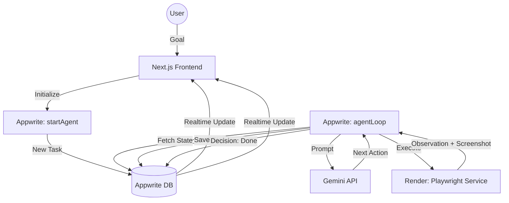

# System Architecture

The Agentic Browser system is designed with a decoupled, event-driven architecture to ensure scalability and reliability.

## Component Overview

### 1. Frontend (Next.js)

- **Framework:** Next.js (App Router)
- **State Management:** React Hooks + Appwrite SDK
- **Real-time:** Appwrite Realtime for streaming logs and status updates.
- **Role:** User interface for providing goals, monitoring the agent's reasoning, and viewing final results.

### 2. Orchestration Layer (Appwrite Functions)

- **Functions:**
  - `startAgent`: Triggered by frontend to initialize a task document.
  - `agentLoop`: The core reasoning Engine. It calls Gemini API for planning and the Executor for actions.
- **Database:** Appwrite Database stores all task states, steps, and observations.
- **Role:** High-level logic controller and security gateway for API keys.

### 3. Browser Executor (Playwright)

- **Runtime:** Node.js with Playwright.
- **Environment:** Dockerized for consistent Chromium execution on Render.
- **Internal API:**
  - `POST /action`: Executes a specific command (click, type, etc.) and returns a screenshot + page DOM.
- **Role:** The "physical" interface that interacts with the web.

### 4. AI Engine (Gemini API)

- **Model:** Gemini 1.5 Pro / Flash.
- **Prompt Strategy:** Chain-of-Thought prompting to decompose goals into executable steps.
- **Role:** The "brain" that plans and decides based on what it sees on the page.

## Data Flow Diagram

