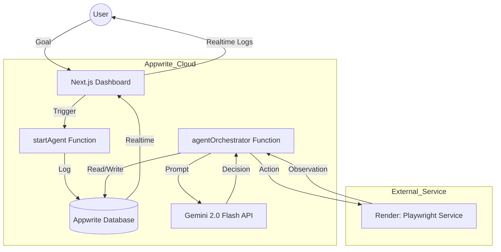

# Project Architecture

The Agentic Browser system is designed as a modular, decoupled monorepo.

## 🏗 High-Level Diagram

## 🛠 Component Roles

### 1. Frontend (Next.js)

- **Dashboard:** Interface for triggering tasks.
- **Realtime Monitor:** Uses Appwrite Realtime to stream logs and browser steps.
- **Security:** Does not handle AI keys; all sensitive logic is backend-restricted.

### 2. Backend Orchestrator (Appwrite Functions)

- **State Management:** Tracks tasks and individual steps in the database.
- **Intelligence:** Communicates with Gemini API to decide the next move.
- **Coordination:** Acts as the bridge between the AI's intent and the Browser's execution.

### 3. Browser Executor (Playwright)

- **Chrome Instance:** Runs a headless browser in a Docker container on Render.
- **Remote Execution:** Exposes a secure API to perform clicks, typing, and navigation.
- **Sensing:** Returns screenshots and DOM data (observations) to the AI.

### 4. Database (Appwrite)

- **Collections:** `tasks`, `steps`, `logs`, `snapshots`.
- **Persistence:** Allows for asynchronous execution and history review.
